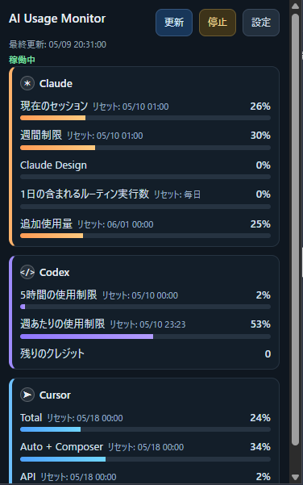
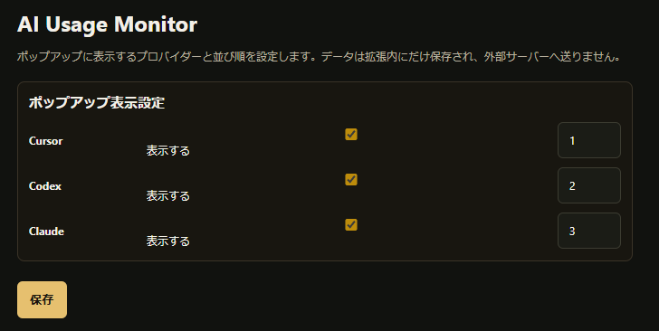
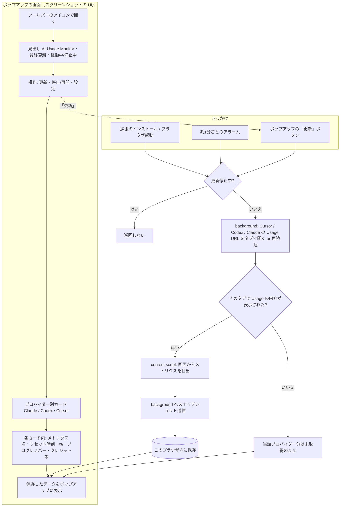

# AI Usage Monitor（Chrome 拡張）

## 画面イメージ

Chrome の**ツールバーにあるこの拡張のアイコン**を押すと、小さなウィンドウ（ポップアップ）が開きます。そこで Claude・Codex・Cursor の使いみちを、バーや％、リセットの日時などひと目で見られます。

## 概要

Cursor・Codex・Claude の公式サイトにある**使用量のページ**に出ている数字を読み取り、**ツールバーのポップアップ**にまとめて表示します（Chrome 拡張、Manifest V3）。

読み取った内容は**このブラウザの中にだけ**保存します。外部のサーバーへ送ったり、別の端末と同期したりはしません。

[プライバシーポリシー（英語・日本語）](PRIVACY.md) — Chrome Web Store 申請時の URL 用にも使えます。

## インストール

まず配布用 ZIP を入手します。

- **v0.2.0 をそのまま使う場合:** [ai-usage-monitor-v0.2.0.zip をダウンロード](https://github.com/sinoda1114/AI-Usage-Monitor/raw/main/releases/ai-usage-monitor-v0.2.0.zip)（`main` ブランチに同梱されているファイルへの直リンクです）
- **別バージョンや Release 資産を探す場合:** [GitHub の Releases 一覧](https://github.com/sinoda1114/AI-Usage-Monitor/releases)

1. 上のリンクから **ZIP をダウンロードして展開する**（中に `manifest.json` などが並んだフォルダができます）。
2. Chrome のアドレスバーに `chrome://extensions` と入力して開く。
3. 右上の **「デベロッパーモード」** をオンにする。
4. **「パッケージ化されていない拡張機能を読み込む」** を押し、さきほど展開したフォルダ（`manifest.json` が入っている階層）を選ぶ。

## 使い方

1. 拡張を入れると、裏で各サービスの使用量ページを開き直したりして、数字を取りに行きます（ポップアップで**停止**にしているあいだは動きません。**再開**でまた始まります）。
2. **ツールバーのアイコン**を押すと、いま保存されている内容がポップアップに出ます。
3. ポップアップの **「設定」** からオプションを開けます。下の画面のとおりです。
   - **表示／非表示** … 各行の **「表示する」** のチェックを入れると、そのサービスがポップアップに出ます。**チェックを外すと、ポップアップの一覧には出ません。**
   - **並び替え** … 右の **数字** が小さいほど、ポップアップで **上** に表示されます（例: 1 が一番上）。Cursor・Codex・Claude を好きな順に並べ替えられます。
   - 変えたあとは **「保存」** を押してください。

## 注意（必読）

**数字が取れるのは、各サービスの公式の「使用量」ページが、ログインした状態でちゃんと表示されているときだけです。**

- 拡張が裏でタブを開いても、**ログインしていない・時間が切れている・ブロックされている**などでページが空なら、数字は入りません。
- うまく出ないときは、**自分でそのサービスの使用量ページを開いて、画面に数字が出ているか**確かめてください。
- 各サービスが画面の見た目や文言を変えると、この拡張が追いつかず表示されなくなることがあります。

## 処理の流れ（ざっくり）

下の図の「ポップアップの画面」は、さきほどのスクリーンショットのような**拡張のウィンドウ**のことです。

**クラウドに上げたり、別の端末と同期したりはしません。** このブラウザに保存した内容を、ポップアップが見せているだけです。取れていないサービスは、カードが空か、前に取れた数字のままになることがあります。
